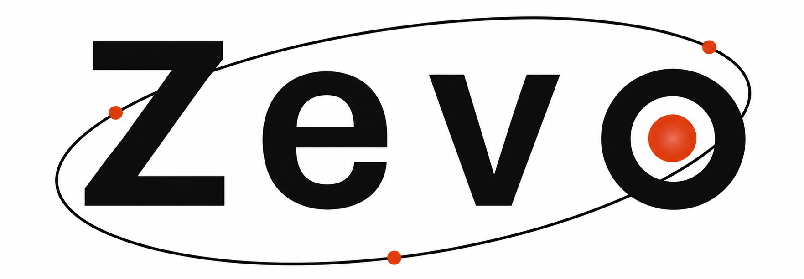
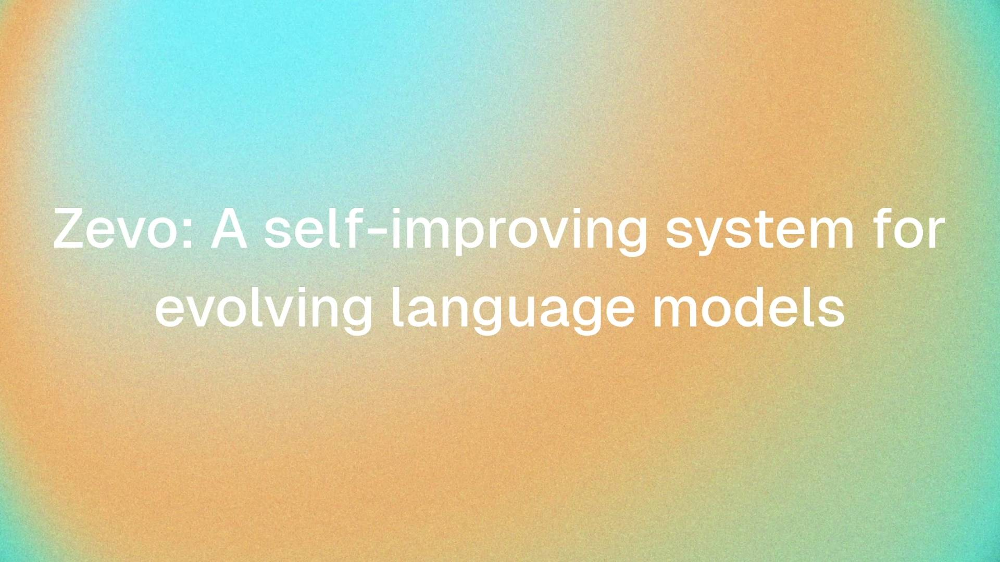
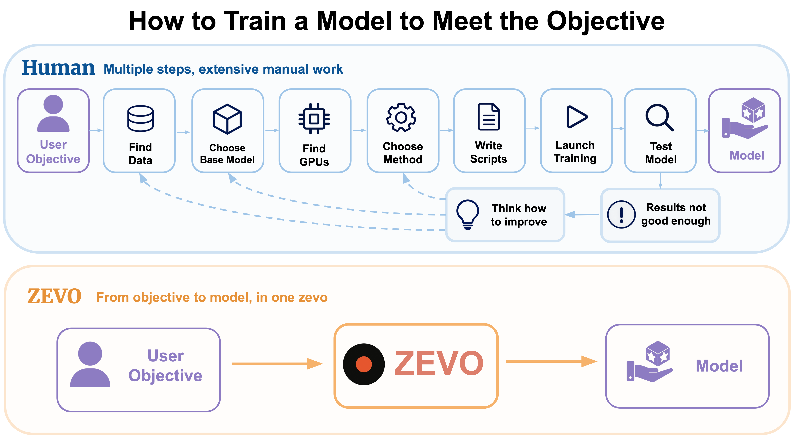
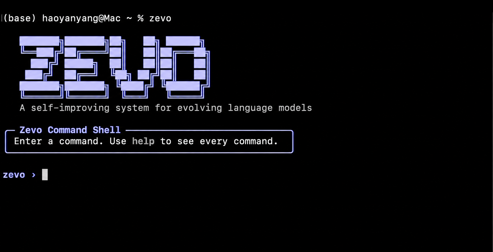
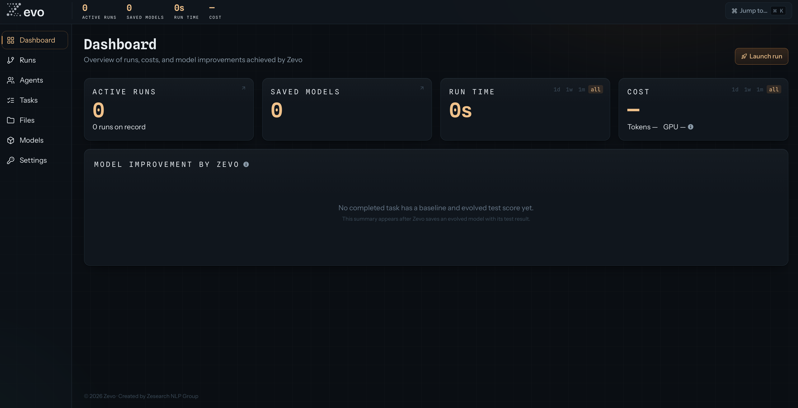

<div align="center">


<h3 style="margin-top: 0.25rem;">
  Haoyan Yang · Sai Akhil Kogilathota · Jiawei Zhou
  <br><br>
  Zesearch NLP Lab, Stony Brook University
</h3>

</div>

[](https://zevoai.dev)

<h3 align="center">
  <a href="#quick-start">Quick Start</a> ·
  <a href="https://zevoai.dev/docs">User Manual</a> ·
  <a href="https://zevoai.dev">Website</a> ·
  <a href="https://github.com/Zesearch/Zevo">GitHub</a>
</h3>

## Changelog

- **09/2026** — Released [Zevo v0.1.0-preview](https://github.com/Zesearch/Zevo/releases/tag/v0.1.0-preview) with the [User Manual](https://zevoai.dev/docs/).
- **08/2026** — Released the [Zevo project website](https://zevoai.dev).

## Zevo Demo

▶️ Click the following image to watch the demo video.

[](https://huggingface.co/datasets/VolleySai/zevo-assets/resolve/main/my-demo.mp4)

## Overview

Zevo is a self-improving system that uses multi-agent collaboration to autonomously evolve language models toward a user-defined objective.



- 🤖 **Autonomous**
  - Zevo plans and runs the complete improvement loop end to end without human intervention after launch.
- 🎯 **Reliable Evaluation**
  - Zevo supports user-defined test sets and metrics, so improvement is measured against each user's objective.
  - Zevo optimizes on validation and keeps the optimization loop schema-isolated from the test set, preventing test-set overfitting.
- ⚖️ **Fair Comparison**
  - Zevo fixes prompts, chat templates, decoding strategies, and inference settings in the baseline round so later score gains reflect model evolution rather than a moving setup.
- 🧠 **Flexible Agent Stack**
  - Zevo supports many model families as agents, including GPT models from OpenAI, Claude models from Anthropic, and the latest open-source models through Amazon Bedrock and OpenRouter.
- ⚡ **Infrastructure-Agnostic**
  - Zevo supports rented cloud GPUs, user-owned Slurm clusters, and dedicated GPU machines.
  - Zevo automatically queues and runs jobs, monitors their status, and reads back the results.
- 🔒 **Secure**
  - Zevo keeps secrets and private run state in the local deployment and provides sandbox mode with explicitly scoped agent permissions.
- 🔍 **Transparent**
  - Zevo records every decision, configuration, dataset, model, prediction, score, log, and artifact.
- ♻️ **Resilient**
  - Zevo uses schema, artifact, and heuristic checks to detect failures, automatically repairs recoverable issues, and safely resumes the workflow.

## Agentic Workflow


The **Orchestrator** is Zevo's brain: it directs the experiment, interprets results, selects the next direction, and works with each specialized agent through structured turns. Specialized agents do not communicate directly with one another.

The specialized agents include:

- **Infrastructure** — Manages GPU execution, including resource provisioning, job submission, queue monitoring, and cleanup.
- **Data** — Acquires and prepares training and validation data, and creates a test set when needed.
- **Train** — Trains models on the prepared data using either a user-specified or Zevo-selected method.
- **Inference** — Generates structured predictions using the trained model.
- **Evaluation** — Measures validation and held-out test performance deterministically from the generated predictions.
- **Registry** — Records the champion model selected by validation performance and preserves its lineage.

## Level of Control

Both dimensions describe how much control the user delegates to Zevo, but at different layers. System control modes govern workflow-level control, including evaluation setup, agent configuration, and whether Zevo runs the complete loop. Training autonomy levels govern optimization-level control, including whether Zevo can choose the training data, model, and method. Any end-to-end mode can be paired with L1 to L4.

### System Control Modes

**From M1 to M4, higher modes delegate more workflow-level control to Zevo.**

| Mode | End-to-End Workflow | Zevo Creates Evaluation | Unconstrained Agents |
|---|:---:|:---:|:---:|
| **M1 · Single Stage**<br>The user sends one focused task to one specialized agent. | ✕ | ✕ | ✕ |
| **M2 · Customized**<br>The user provides the evaluation and adds constraints to selected agents. Zevo runs the complete workflow. | ✓ | ✕ | ✕ |
| **M3 · Standard**<br>The user provides the evaluation. Zevo runs the complete workflow. | ✓ | ✕ | ✓ |
| **M4 · Auto**<br>Zevo creates the evaluation and runs the complete workflow. | ✓ | ✓ | ✓ |

### Training Autonomy Levels

**From L1 to L4, higher levels delegate more optimization-level control to Zevo.**

<table width="100%">
  <thead>
    <tr>
      <th align="left" width="55%">Level</th>
      <th align="center" width="15%">Training Data</th>
      <th align="center" width="15%">Training Model</th>
      <th align="center" width="15%">Training Method</th>
    </tr>
  </thead>
  <tbody>
    <tr>
      <td><strong>L1 · Entry Autonomous</strong><br>Zevo iterates within the given data, model, and method.</td>
      <td align="center"><strong>User</strong></td>
      <td align="center"><strong>User</strong></td>
      <td align="center"><strong>User</strong></td>
    </tr>
    <tr>
      <td><strong>L2 · Constraint Autonomous</strong><br>Zevo collects and even creates the training data.</td>
      <td align="center"><strong>Zevo</strong></td>
      <td align="center"><strong>User</strong></td>
      <td align="center"><strong>User</strong></td>
    </tr>
    <tr>
      <td><strong>L3 · Partially Autonomous</strong><br>Zevo picks the training method as well.</td>
      <td align="center"><strong>Zevo</strong></td>
      <td align="center"><strong>User</strong></td>
      <td align="center"><strong>Zevo</strong></td>
    </tr>
    <tr>
      <td><strong>L4 · Fully Autonomous</strong><br>Zevo decides everything from the objective alone.</td>
      <td align="center"><strong>Zevo</strong></td>
      <td align="center"><strong>Zevo</strong></td>
      <td align="center"><strong>Zevo</strong></td>
    </tr>
  </tbody>
</table>

## Interfaces

Zevo supports both a CLI and Web UI for launching, monitoring, and inspecting the complete improvement loop.

<p align="center">
  
  &nbsp;&nbsp;&nbsp;
  
  <br><br>
  <strong>Zevo CLI</strong>
  &emsp;&emsp;&emsp;&emsp;&emsp;&emsp;&emsp;&emsp;&emsp;&emsp;&emsp;&emsp;&emsp;&emsp;&emsp;&emsp;&emsp;&emsp;&emsp;&emsp;&emsp;&emsp;&emsp;&emsp;
  <strong>Zevo Web UI</strong>
</p>

## Quick Start

> **Prerequisites:** Docker with the Compose plugin and Git. A host Python environment is not required.

Clone Zevo and create the five application containers:

```bash
git clone https://github.com/Zesearch/Zevo.git
cd Zevo
cp .env.example .env
docker compose up -d --build
docker compose ps
```

This starts PostgreSQL, the backend, the Web UI, the workflow scheduler, and the isolated held-out Test scheduler.

Install the optional host CLI and enter its interactive shell:

```bash
./install.sh
zevo
```

Open the Web UI at [http://localhost:5173](http://localhost:5173). The Web UI is the primary and recommended way to use Zevo. Compared with the CLI, it provides a more user-friendly interface for configuration, experiment creation, launching Runs, and monitoring progress.

Complete the initial configuration in the Web UI:

1. Open **Settings → Agent API** and save a credential for at least one Agent driver.
2. Recreate the Python services so they load the saved credential:

   ```bash
   docker compose up -d --force-recreate backend scheduler holdout-scheduler
   ```

3. Open **Agents** and choose a ready driver and model for each configurable LLM Agent.
4. Open **Settings → GPU Providers** and configure either a cloud GPU provider or a verified Instance/Cluster SSH connection.

The visible Web UI navigation contains:

- **Dashboard:** Launch a Run and view active Runs, saved models, time, cost, and improvement summaries.
- **Runs:** Monitor iterations, the Agent timeline, artifacts, Tickets, scores, and remote jobs.
- **Agents:** Configure driver and model choices and inspect instructions, Skills, Tickets, and heartbeats.
- **Tasks:** Define reusable objectives and Test contracts, then add reusable experiment Settings.
- **Files:** Upload and organize Test, Validation, and training files, or register remote datasets.
- **Models:** Inspect saved champion models, model cards, results, and lineage.
- **Settings:** Configure Agent credentials, cloud providers, SSH compute, Hugging Face, and Weights & Biases.

For a typical first Run, save the evaluation assets under **Files**, create a Task and optional Setting under **Tasks**, then choose **Launch run** on the Dashboard. Select the Workflow Control mode, configure the requested optimization and compute fields, review the summary, and launch.

For complete instructions, including file formats, every Task and Run parameter, Agent authentication, compute lifecycles, custom evaluators, monitoring, recovery, and CLI commands, see the [User Manual](https://zevoai.dev/docs).

## Citation

If you use Zevo in your research, please cite:

```bibtex
@software{zevo2026,
  author = {Haoyan Yang and Sai Akhil Kogilathota and Jiawei Zhou},
  title  = {Zevo: A Self-Improving System for Evolving Language Models},
  year   = {2026},
  url    = {https://github.com/Zesearch/Zevo}
}
```

Zevo is released under the [Apache License 2.0](LICENSE).

## Team

Zevo is developed by the Zesearch NLP Lab at Stony Brook University:

- Haoyan Yang — [haoyan.yang@stonybrook.edu](mailto:haoyan.yang@stonybrook.edu)
- Sai Akhil Kogilathota — [saiakhilkogilathota@gmail.com](mailto:saiakhilkogilathota@gmail.com)
- Jiawei Zhou — [jiawei.zhou.1@stonybrook.edu](mailto:jiawei.zhou.1@stonybrook.edu)

We are interested in the self-improvement of LLMs and recursive self-improvement (RSI). If you have any questions or ideas, feel free to reach out.
